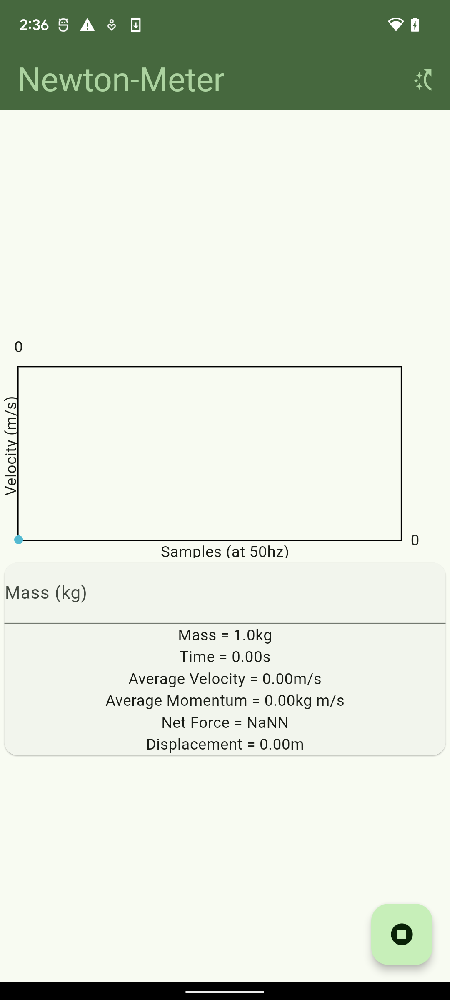
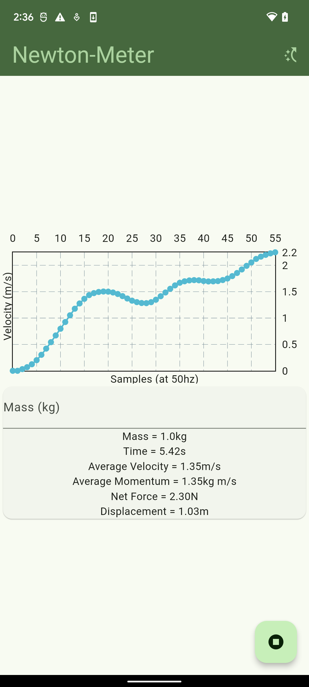
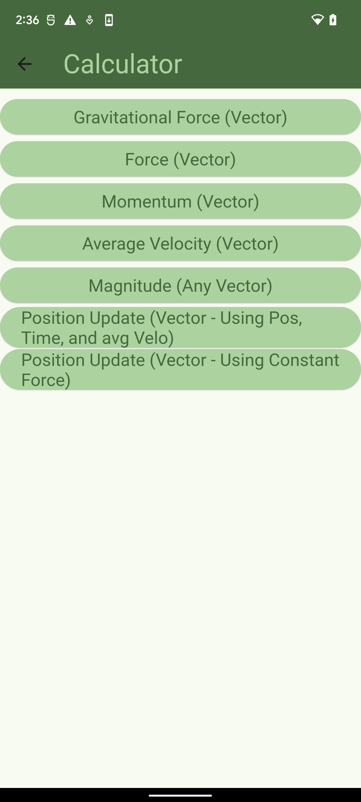
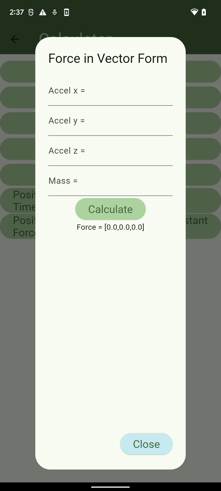
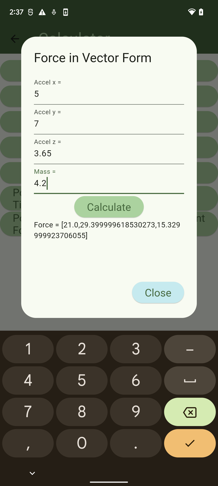

# Newton-Meter

A data-recorder and calculator for anyone interested in physics.

## Usage

To use the "Newton-Meter" data recorder, 
open the app and press the record button in the bottom right.
Wait a little, then press the record button again to stop recording
and analyze and display the results.

To use the physics calculator,
open the app and press the calculator button in the top right.
Then select any physics equation from the list you want,
plugin in the required values, and calculate.

## Screenshots

